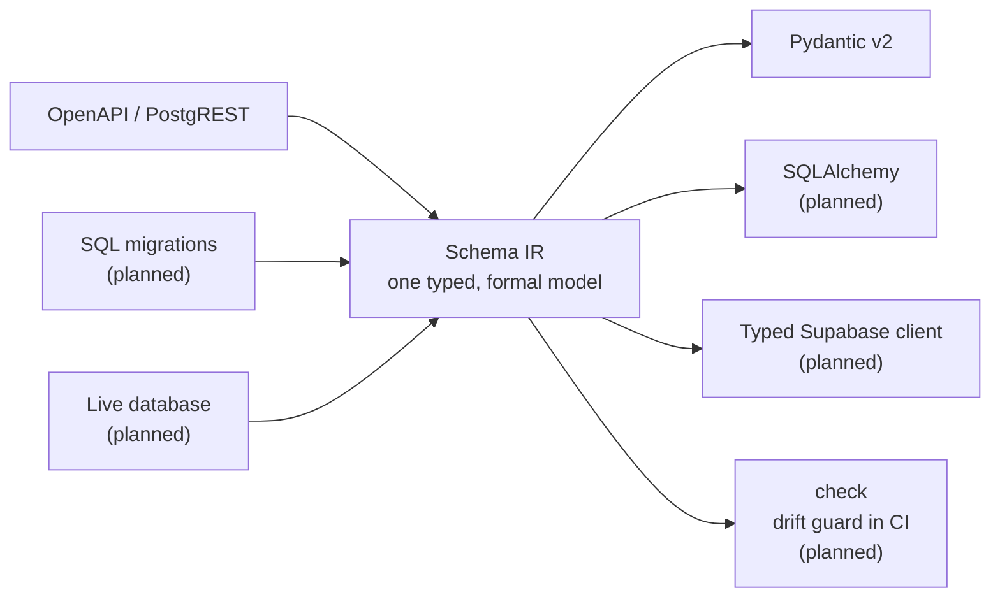

# castiron

**A schema→typed-code compiler for Python.**

Point castiron at a schema source — a Supabase URL, your SQL migrations, or a
live database — and get typed models (and, soon, a typed client for tables,
views, and RPCs). A `check` mode will fail CI when your application code drifts
from the schema. **No database connection required** for the OpenAPI and
migrations sources.

> _"It's cast-iron. It doesn't care."_ — and neither should your types drift.

📖 **[Documentation](https://kmbhm1.github.io/castiron/)**

---

> 🚧 **Status: pre-alpha.** castiron is on PyPI and installable, but it is young and
> moving fast: the pipeline, sources, and emitters are still being built out, and APIs
> may change between releases. It is the successor to
> [`supabase-pydantic`](https://github.com/kmbhm1/supabase-pydantic), carrying
> forward its schema-fidelity engine on a source-agnostic architecture.

## Quickstart

```bash
uv add cast-iron       # or: pip install cast-iron
castiron --version     # the command has no hyphen
```

You install the hyphenated **`cast-iron`** and run the unhyphenated **`castiron`**. PyPI
does not allow `castiron` as a distribution name, so the hyphen belongs to the
distribution and nothing else — the command, the import package (`import castiron`), and
this repository all stay unhyphenated.

Generate typed Pydantic models from a Supabase project — one command, no database
connection, no driver, no connection string:

```bash
export CASTIRON_KEY='eyJhbGciOi...'
castiron gen --from https://abcdefgh.supabase.co --emit pydantic
```

```
castiron: read 6 tables, 1 enum and 4 functions from https://abcdefgh.supabase.co/rest/v1/
castiron: wrote schema.py (14.2 kB)
```

`--from` also takes a path, so a saved OpenAPI document regenerates offline — useful in
CI and air-gapped builds:

```bash
castiron gen --from ./openapi.json --emit pydantic --output src/myapp/models
```

You get one file with Row, `Insert`, `Update` and operational models, enum classes, and
nested foreign-key relationships:

```python
class Orders(OrdersBaseSchema):
    """Orders Schema for Pydantic.

    Customer orders.

    Inherits from OrdersBaseSchema. Add any customization here.
    """

    # Foreign Keys
    user: Users | None = Field(default=None)
    order_items: list[OrderItems] | None = Field(default=None)
```

Every file opens with a two-line header recording the castiron version that wrote it — no
timestamp, no source URL. Output is deterministic: the same schema, the same options and the
same castiron version produce the same bytes, every time, and it is lint-clean as emitted under
ruff's `F`, `UP` and `I` rules at ruff's own defaults. See
**[The generated code](https://kmbhm1.github.io/castiron/reference/generated-code/)** for that
promise, its limits, the header's exact format, and how enum member names are derived.

Put your settings in `pyproject.toml` and the flags go away (the API key is deliberately
**rejected** there — that file gets committed):

```toml
[tool.castiron]
from = "https://abcdefgh.supabase.co"
emit = ["pydantic"]
output = "src/myapp/models"
```

Full walkthrough: **[Quickstart](https://kmbhm1.github.io/castiron/getting-started/quickstart/)** ·
**[CLI reference](https://kmbhm1.github.io/castiron/reference/cli/)** ·
**[Configuration](https://kmbhm1.github.io/castiron/reference/configuration/)**

## The idea



Pluggable **sources** parse a schema into one formalized **Schema IR**; pluggable
**emitters** turn the IR into typed code. **`check`** — planned, not yet a command —
will re-emit in memory and fail if the committed output has drifted.

## Honest about what it knows

The OpenAPI source needs no database credentials and sees everything your API key can
see — column types, nullability, primary keys, single-column foreign keys, enums, and RPC
signatures. It **cannot** see unique or check constraints, identity/generated columns,
exact integer widths below `bigint`, or function return types. castiron does not guess at
them; it documents them and warns when one is about to change your output.

Read **[What the OpenAPI source can and cannot see](https://kmbhm1.github.io/castiron/sources/openapi/)**
before you trust a generated constraint.

## Why "castiron"

Cast iron is durable, low-maintenance, and does one job for decades. It also puns
on type **cast**ing — casting an untyped schema into hard, checked types.

## Development

castiron uses [`uv`](https://docs.astral.sh/uv/) and `hatchling`.

```bash
uv sync                 # create the environment and install dev deps
uv run castiron --version
make validate           # ruff + vulture + mypy + pytest (the pre-push gate)
make serve-docs         # preview the documentation site
```

See [CONTRIBUTING.md](CONTRIBUTING.md).

## License

[MIT](LICENSE) © Kevin Boehm
