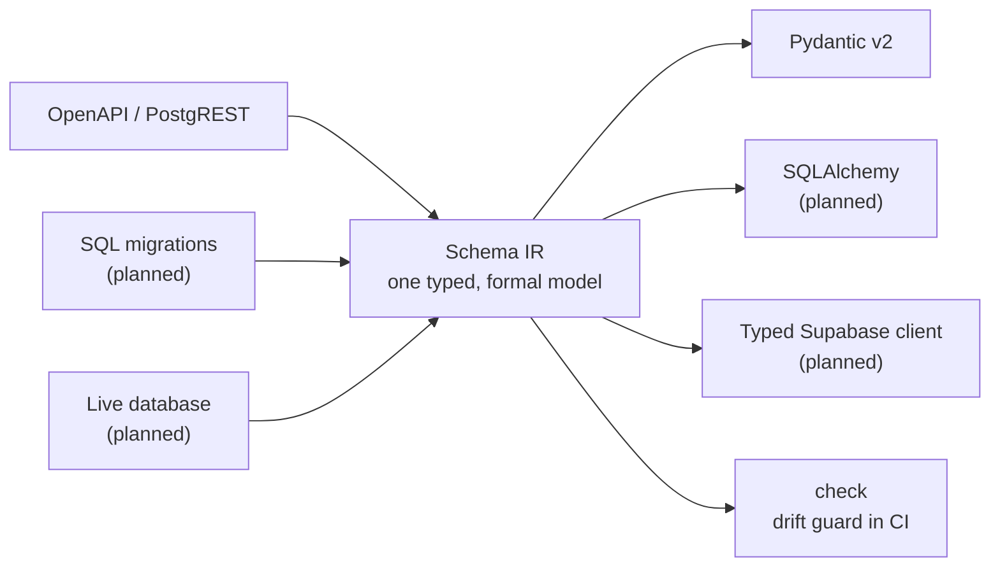

# castiron

**A schema→typed-code compiler for Python.**

Point castiron at a schema source — a Supabase URL, your SQL migrations, or a live
database — and get typed models (and, soon, a typed client for tables, views, and RPCs).
A `check` mode fails CI when your committed generated code drifts from the schema.

```bash
castiron gen --from https://abcdefgh.supabase.co --emit pydantic
```

```
castiron: read 6 tables, 1 enum and 4 functions from https://abcdefgh.supabase.co/rest/v1/
castiron: wrote schema.py (14.2 kB)
```

No database connection. No driver. No connection string.

[Get started](getting-started/quickstart.md){ .md-button .md-button--primary }

!!! warning "Pre-alpha"
    castiron is on PyPI and installable, but it is young and moving fast — APIs may
    change between releases. What is documented here is what ships today: the `gen` and
    `check` commands, the OpenAPI/PostgREST source, and the Pydantic emitter. It is the
    successor to [`supabase-pydantic`](https://github.com/kmbhm1/supabase-pydantic).

## Architecture

Pluggable **sources** parse a schema into one formalized **Schema IR**; pluggable
**emitters** turn the IR into typed code. **`check`** re-emits in memory and fails if the
committed output has drifted from the schema.



## What works today

| Piece | Status |
| --- | --- |
| `castiron gen` — the CLI, with a `[tool.castiron]` project config | shipped |
| OpenAPI/PostgREST source (a Supabase URL, a PostgREST root, or a saved JSON document) | shipped |
| Pydantic v2 emitter — Row / Insert / Update / operational models, enums, FK relationships | shipped |
| Byte-stable, deterministic output, [lint-clean as emitted](reference/generated-code.md) | shipped |
| SQL-migration and live-database sources | planned |
| SQLAlchemy emitter, typed Supabase client | planned |
| `castiron check` — the drift guard, [exit `3` on drift](reference/exit-codes.md) | shipped |

## Honest by design

castiron's OpenAPI source needs no credentials and pays a real price for it: unique and
check constraints, identity columns, exact integer widths below `bigint`, and function
return types are simply not in the document it reads. castiron does not guess at them —
it documents them, warns when one of them is about to change your output, and points at
the live-database path for when you need the rest.

Read [What the OpenAPI source can and cannot see](sources/openapi.md) before you trust a
generated constraint.

## Install

```bash
uv add cast-iron       # or: pip install cast-iron
castiron --version     # the command has no hyphen
```

!!! info "You install `cast-iron`; you run `castiron`"
    The hyphen belongs to the distribution name and nothing else. The command, the import
    package (`import castiron`), and this repository all stay unhyphenated — the same
    ordinary split as `pip install python-dateutil` → `import dateutil`, or
    `pip install scikit-learn` → `import sklearn`. PyPI does not allow `castiron` as a
    distribution name, so this is permanent rather than a stopgap.

Working on castiron itself? [Run it from a checkout](getting-started/quickstart.md#from-a-checkout)
instead.

## Why "castiron"

Cast iron is durable, low-maintenance, and does one job for decades. It also puns on type
**cast**ing — casting an untyped schema into hard, checked types.
