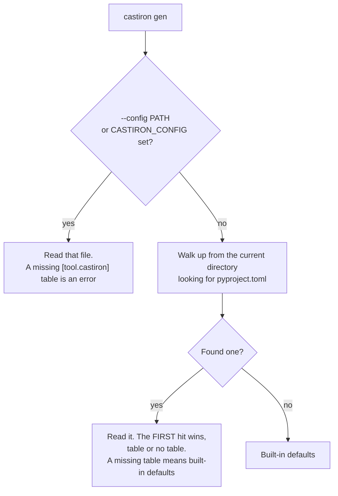

# Configuration

castiron reads its project settings from a **`[tool.castiron]`** table. Put it in your
`pyproject.toml` and `castiron gen` needs no flags at all — which is the point: CI and
your laptop run the same generation from one committed source of truth.

```toml
[tool.castiron]
from = "https://abcdefgh.supabase.co"
emit = ["pydantic"]
output = "src/myapp/models"
```

```bash
castiron gen
```

## Which file is read



Three rules, and no others:

1. **`--config PATH` (or `CASTIRON_CONFIG`) wins.** click checks the file exists, so a
   bad path is a usage error (exit `2`). A file you named explicitly that has **no**
   `[tool.castiron]` table is an error (exit `1`) — silently using nothing from a file you
   asked for by name is worse than failing:

    ```
    Error: notable.toml has no [tool.castiron] table. Add one, or drop --config to use the nearest pyproject.toml.
    ```

2. **Otherwise, the nearest `pyproject.toml` walking up from the current directory.** The
   *first* one found wins whether or not it carries a `[tool.castiron]` table — one
   `pyproject.toml` defines the project, and continuing the walk could silently inherit a
   parent monorepo's settings. A `pyproject.toml` without the table simply contributes
   nothing.

3. **No file, no config.** Built-in defaults only.

The table is always `[tool.castiron]`, **in every file** — including a standalone one you
pass to `--config`. One rule, zero ambiguity, and the block copy-pastes between files:

```toml
# castiron.toml
[tool.castiron]
from = "openapi.json"
output = "gen"
```

```bash
castiron gen --config castiron.toml
```

## Precedence

Settings resolve in exactly this order, highest first. This is click's own resolution
chain — castiron does not hand-roll it, which is why it behaves the same for every
option.

| Rank | Layer | Example |
| --- | --- | --- |
| **1 (highest)** | Command-line flag | `--output build/` |
| **2** | Environment variable | `CASTIRON_FROM`, `CASTIRON_KEY` |
| **3** | Config file `[tool.castiron]` | `output = "src/myapp/models"` |
| **4 (lowest)** | Built-in default | `output` is `.` |

Three consequences worth knowing:

- **Booleans override in both directions.** Every flag is declared as a `--x/--no-x`
  pair, so `--crud-models` on the command line beats `crud-models = false` in the file
  just as `--no-crud-models` beats `crud-models = true`. That is why there is no
  `--no-config` escape hatch — you never need one.
- **Lists replace, never merge.** Given a file with `emit = ["pydantic", "sqlalchemy"]`,
  `--emit pydantic` on the command line yields exactly `pydantic` — the flag *replaces* the
  list rather than adding to it. ⚠ That example is **illustrative, not runnable today**:
  `pydantic` is the only registered emitter, and a config naming any other is rejected before
  the override is even considered, so this particular file fails with
  `[tool.castiron] 'emit' names no registered emitter: 'sqlalchemy'` whatever you pass on the
  command line. That is deliberate — a typo in a committed `pyproject.toml` should be
  diagnosed against the file, not silently overridden. The SQLAlchemy emitter is on the
  roadmap; until it lands, read the rule and not the emitter names.
- **Only three settings have environment variables** (`--config`, `--from`, `--key`).
  Everything else is a flag or a config key, because everything else belongs somewhere
  reviewable. See [Environment variables](environment-variables.md).

## The keys

Config keys **are** the flag names. Dashes and underscores are interchangeable
(`crud-models` and `crud_models` both work); dashes are the documented spelling. There is
exactly one alias — `from`, because `source` would not match the flag and `from` is a
Python keyword the CLI parameter cannot be called.

```toml
[tool.castiron]
from = "https://abcdefgh.supabase.co"     # or "./openapi.json"
emit = ["pydantic"]
output = "src/myapp/models"
filename = "schema.py"
schema = "public"
timeout = 30.0
overwrite = true
infer-generated-primary-keys = false
crud-models = true
enums = true
foreign-keys = true
null-parent-classes = false
singular-names = false
model-prefix-protection = true
```

| Key | TOML type | Flag | Default |
| --- | --- | --- | --- |
| `from` | string | `-f, --from` | — (required, one way or another) |
| `emit` | array of strings | `-e, --emit` | `["pydantic"]` |
| `output` | string (path) | `-o, --output` | `"."` |
| `filename` | string | `--filename` | the emitter's own (`schema.py` for `pydantic`) |
| `schema` | string | `-s, --schema` | `"public"` |
| `timeout` | number | `--timeout` | `30.0` |
| `overwrite` | boolean | `--overwrite / --no-overwrite` | `true` |
| `infer-generated-primary-keys` | boolean | `--infer-generated-primary-keys / --no-…` | `false` |
| `crud-models` | boolean | `--crud-models / --no-crud-models` | `true` |
| `enums` | boolean | `--enums / --no-enums` | `true` |
| `foreign-keys` | boolean | `--foreign-keys / --no-foreign-keys` | `true` |
| `null-parent-classes` | boolean | `--null-parent-classes / --no-…` | `false` |
| `singular-names` | boolean | `--singular-names / --no-singular-names` | `false` |
| `model-prefix-protection` | boolean | `--model-prefix-protection / --no-…` | `true` |
| `check` | table | — | reserved, see [below](#reserved-toolcastironcheck) |

`--verbose`, `--quiet` and `--debug` are deliberately **not** config keys. They are
per-invocation choices, not project settings.

## Relative paths resolve against the config file

`from` and `output` are anchored to **the directory holding the config file**, not to
your shell's current directory — the way `ruff`, `mypy` and `coverage` read their
configuration. A URL `from` is never anchored, and an absolute path is left alone.

Given `proj/pyproject.toml`:

```toml
[tool.castiron]
from = "openapi.json"
output = "src/myapp/models"
```

both of these write the same file:

```bash
cd proj && castiron gen
```

```
castiron: read 6 tables, 1 enum and 4 functions from /home/you/proj/openapi.json
castiron: wrote src/myapp/models/schema.py (8.5 kB)
```

```bash
cd proj/src/myapp/sub && castiron gen
```

```
castiron: read 6 tables, 1 enum and 4 functions from /home/you/proj/openapi.json
castiron: wrote /home/you/proj/src/myapp/models/schema.py (8.5 kB)
```

Two reasons this matters more than it looks. The config file exists so CI and local runs
share one source of truth, which it cannot do if `output = "src/myapp/models"` means a
different directory depending on where you happened to stand. And `castiron check` must
not give a directory-dependent verdict — a guard whose answer depends on where it runs is
worse than no guard.

!!! note "Environment variables are not anchored"
    `CASTIRON_FROM=./openapi.json` is resolved against your current directory, like any
    other shell path. Only *config-file* values are anchored to the config file.

## The API key is rejected here

There is no `key` config setting, and there never will be. `pyproject.toml` is a
committed file; a tool that tolerated a secret in it would be teaching you to leak one.

```toml
[tool.castiron]
from = "./openapi.json"
key = "eyJhbGciOi..."
```

```
Error: /home/you/proj/pyproject.toml: [tool.castiron] must not contain 'key': pyproject.toml is committed. Pass --key or set CASTIRON_KEY.
```

The rule holds in a standalone `--config` file too — one rule, no "it depends". Pass
`--key`, or better, set [`CASTIRON_KEY`](environment-variables.md).

## Mistakes are loud

An ignored typo in a config file produces output that is wrong in a way you cannot see,
which is the exact failure mode castiron exists to eliminate. So every malformed table is
a hard failure (exit `1`) naming the file and the key.

**Unknown key** — with a suggestion and the full valid list:

```
Error: /home/you/proj/pyproject.toml: unknown key 'outputt' in [tool.castiron]. Did you mean 'output'? Valid keys: check, crud-models, emit, enums, filename, foreign-keys, from, infer-generated-primary-keys, model-prefix-protection, null-parent-classes, output, overwrite, schema, singular-names, timeout.
```

**Wrong type** — naming what was expected and what was found. The value itself is never
echoed back, because a `from` URL can carry a credential in its query string:

```
Error: /home/you/proj/pyproject.toml: [tool.castiron] 'timeout' must be a number, but it is a string.
```

**Malformed TOML** — with the parser's own position:

```
Error: bad.toml is not valid TOML: Expected ']' at the end of a table declaration (at line 1, column 15)
```

**An `emit` entry that names no registered emitter** is caught here too, naming the file
— rather than as a bare usage error that never mentions your `pyproject.toml`.

The cost of this strictness is honest and accepted: a config file written for a newer
castiron will be rejected by an older one. Pre-1.0, silent wrongness is the worse trade.

## Reserved: `[tool.castiron.check]`

```toml
[tool.castiron]
from = "openapi.json"

# Reserved for future `castiron check` settings. Parsed, validated as a table, and ignored.
[tool.castiron.check]
```

The table is accepted today and does nothing — **including now that `castiron check`
exists**. `check` reads the same flat `[tool.castiron]` keys `gen` does, which is the whole
reason the config file exists: you write `from`/`emit`/`output` once and both commands honour
them. Keys `check` has no flag for (`overwrite`) are simply never looked up.

The sub-table stays reserved for settings that would apply to `check` and to nothing else.
Writing a scalar there is still an error — the shape is reserved, not the name:

```
Error: badcheck.toml: [tool.castiron] 'check' must be a table, but it is an integer. It is reserved for `castiron check`.
```
