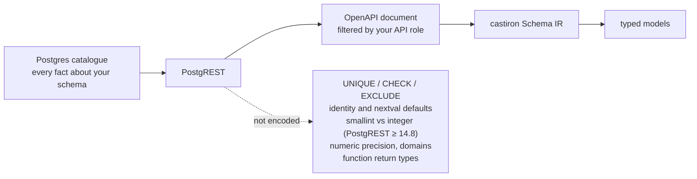

# The OpenAPI source: what it can and cannot see

> The OpenAPI source needs no database credentials and sees everything your API key can
> see — column types, nullability, primary keys, single-column foreign keys, enums, and
> RPC argument names, types and (in almost every case) declaration order. It cannot see unique
> or check constraints, identity/generated columns, exact integer widths below `bigint`
> (on PostgREST ≥ 14.8 — an older server keeps them,
> [why](#integer-widths-depend-on-your-postgrest-version)), or function return types — and
> for a `VOLATILE` function with defaulted arguments it recovers only part of the argument
> order, telling you which part. **Function volatility depends on your
> server: below PostgREST 13.0.5 the document does not encode it at all**, and castiron reports
> it as unknown rather than guessing ([why](#volatility-depends-on-your-postgrest-version)).
> Point castiron at the database itself when you need those.

That is the whole page in one paragraph. The rest explains *why* each limit exists, what it
does to your generated code, and what to do about it — because a code generator that
overstates what it knows is worse than one that tells you where it stops.

## The trade



castiron reads one document: the **OpenAPI (Swagger 2.0) description PostgREST publishes
at its API root**. One authenticated `GET`, no driver, no connection string, no firewall
rule. Every fact castiron knows about your schema is a fact PostgREST chose to encode
there — and PostgREST built that document to describe an HTTP API, not to reproduce a
Postgres catalogue.

So the source's ceiling is PostgREST's ceiling. That is not a defect castiron can patch:
the information is not in the file. What castiron *can* do — and does — is refuse to
guess. Anything the document does not state stays unknown rather than becoming a
plausible-looking lie in your models.

Two further consequences of reading an API description rather than a catalogue:

- **You see what your API role sees — object by object, not column by column.** Tables and
  functions your key cannot access are not "hidden": they are absent, indistinguishable from
  not existing. This is why the run summary prints the counts it read; `read 2 tables`
  when you expected 20 is your signal. **Column-level privileges are a different matter —
  PostgREST does not apply them to the document at all**, so castiron emits fields for
  columns your key cannot read. See
  [Privileges filter objects, not columns](#privileges-filter-objects-not-columns).
- **One schema per document.** PostgREST serves one schema at a time, selected by
  `Accept-Profile` (castiron's `--schema`). Cross-schema foreign keys are not resolvable
  from a single run.

## The full picture

Legend: **✅ full** — the fact is exact. **⚠ partial** — something survives, degraded.
**❌ absent** — not in the document at all. **n/a** — the comparison does not apply.

### Tables, views and columns

| Fact | OpenAPI source | Live DB source (planned) | Why |
| --- | --- | --- | --- |
| Table/view names, columns | ✅ full | ✅ | `definitions` |
| Column nullability | ✅ full for tables; ⚠ **every view column is reported nullable** | ✅ | `required` lists exactly the NOT NULL columns; PostgREST reports view columns nullable |
| Table vs view | ⚠ **inferred from one signal** — no view marker is emitted, so a non-empty `required` list means `BASE TABLE` and anything else means `VIEW`; see [below](#table-or-view-is-inferred-from-one-signal) | ✅ `relkind` | the document carries no marker |
| Column type | ⚠ **on PostgREST ≥ 14.8, `smallint` and `integer` both arrive as `int32`** and `bigint` as `int64`; **below 14.8** `format` carries the Postgres type name and all three widths stay distinct. Every other type keeps its Postgres name on either server. See [below](#integer-widths-depend-on-your-postgrest-version) | ✅ exact | PostgREST's `toSwaggerFormat`, which only spells integers `int32`/`int64` from **14.8** |
| Numeric precision/scale, `varchar(n)` typmod | ❌ lost (`maxLength` survives, but see [below](#string-lengths-survive-but-do-not-become-constraints)) | ✅ | `format_type(atttypid, NULL)` erases them |
| Domain types | ❌ collapse to their base type | ✅ | resolved before the document is built |
| Column default | ⚠ **only when it survives a JSON decode** — string-ish defaults (`now()`, `gen_random_uuid()`, `'text'`) come through; **`nextval(...)` is silently dropped** | ✅ | PostgREST re-quotes string-ish defaults as JSON; for other types the raw default text must itself be valid JSON |
| Identity / generated columns | ❌ **always false** — see [below](#identity-and-generated-columns) | ✅ | no `nextval` reaches the document |
| Column comments | ✅ full | ✅ | `description` |
| Table comments | ✅ full | ✅ | `definitions.<t>.description` → the model docstring |
| Objects (tables, views, functions) the API role cannot see | ❌ **invisible** — RLS and privileges silently shrink the schema | ✅ | PostgREST's default openapi-mode |
| Columns the API role cannot `SELECT` | ⚠ **still described, and still emitted** — column privileges are not applied to the document; see [below](#privileges-filter-objects-not-columns) | n/a | PostgREST filters relations, not columns — a generated model is not a privilege boundary |

### Keys and constraints

| Fact | OpenAPI source | Live DB source (planned) | Why |
| --- | --- | --- | --- |
| Primary-key membership | ✅ full | ✅ | `<pk/>` marker in a column's description |
| Composite primary-key **order** | ❌ not recoverable | ✅ | markers are per column, unordered |
| A view's primary key | ⚠ recorded as **UNIQUE, not PRIMARY KEY** — see [below](#views) | ✅ | a downgrade, not a guess |
| Foreign keys | ⚠ **single-column only**; no schema | ✅ | `<fk table='..' column='..'/>` marker |
| Composite foreign keys | ❌ invisible; a column in two foreign keys reports only one | ✅ | one marker per column |
| A foreign key whose **target table you cannot see** | ⚠ **the relationship is dropped**, the constraint is kept, and castiron warns once — see [below](#a-foreign-key-can-point-at-a-table-you-cannot-see) | ✅ | privileges filter relations, not markers |
| **Constraint names** (primary key, unique **and** foreign key) | ❌ **never in the document** — castiron synthesizes Postgres's own defaults (`<table>_pkey`, `<table>_<cols>_key`, `<table>_<column>_fkey`) and marks every one `name_is_synthesized` — see [below](#constraint-names-are-manufactured) | ✅ `pg_constraint.conname` | not encoded |
| **UNIQUE constraints** | ❌ **absent entirely** | ✅ | not in the document |
| **CHECK constraints** | ❌ **absent entirely** | ✅ | not in the document |
| **EXCLUDE constraints** | ❌ absent | ✅ | not in the document |
| Cross-schema / multi-schema | ❌ one schema per document | ✅ | PostgREST design |

### Enums

| Fact | OpenAPI source | Live DB source (planned) | Why |
| --- | --- | --- | --- |
| Enum values on a scalar column | ✅ full, **with the type name** (schema-qualified when needed) | ✅ | `enum` + `format` |
| Enum values on an **array** column | ⚠ **absent** — such a column links to an enum only if the same enum also appears on a scalar column somewhere in the document; otherwise it degrades to `list[Any]` | ✅ | PostgREST looks up `pg_enum` by base type, which misses array types |

### Functions (RPCs)

| Fact | OpenAPI source | Live DB source (planned) | Why |
| --- | --- | --- | --- |
| Name, schema | ✅ full | ✅ | the `/rpc/<name>` path key |
| Argument names, has-default | ✅ full | ✅ | the POST body schema's `properties` and `required` |
| Argument **order** | ✅ **full** for a `STABLE`/`IMMUTABLE` function, and for a `VOLATILE` one whose arguments are all required; ⚠ **partial** for a `VOLATILE` function with defaulted arguments — the required prefix is right and the defaulted tail is name-sorted. `FunctionInfo.parameter_order` says which you got. Below PostgREST 13.0.5 a GET exists for **every** function, so order is recovered in **full** for `VOLATILE` ones too. See [below](#argument-order-is-only-partly-encoded) | ✅ | the POST body's `properties` is a sorted map, but the GET `parameters` and the body's `required` are **ordered arrays** |
| Argument types | ⚠ **as degraded as a column type, plus one loss beyond it** — the same version-scoped integer collapse (`smallint` and `integer` both `int32` on PostgREST ≥ 14.8, distinct below it), and `char(2)` arrives as `character` with **no `maxLength`**, which the same column would carry | ✅ exact | `toSwaggerFormat` again; `maxLength` is emitted for columns only |
| An argument's **enum values** | ❌ **never carried on the argument** — it links to an enum only if the same enum also appears on a scalar column somewhere in the document; otherwise the argument keeps a bare type name and no values | ✅ | the parameter declares `format` but no `enum` list, and its type name is unqualified |
| **Return type** | ❌ **never available** | ✅ | responses carry only `"OK"` |
| **Set-returning** | ❌ **never available** | ✅ `proretset` | not encoded |
| Volatility | ⚠ **binary only, and only on PostgREST ≥ 13.0.5** — `VOLATILE` (POST-only) vs non-volatile (a GET exists); `STABLE` vs `IMMUTABLE` unknown. **Below 13.0.5** the document emits a GET for every `/rpc/` path, so castiron reports `None` — unknown — rather than asserting anything. See [below](#volatility-depends-on-your-postgrest-version) | ✅ `provolatile` | the GET is only gated on volatility from **13.0.5** onward |
| `is_read_only` | ⚠ **only on PostgREST ≥ 13.0.5** — a GET operation exists. **Below 13.0.5** it is `None`, unknown, for every function; castiron will not tell you a mutation is read-only | ✅ `provolatile != 'v'` | the same method gating, so the same version floor |
| **Overloads** | ❌ **collapsed upstream** — one arbitrary signature survives | ✅ | one path key per function name |
| `OUT` / `INOUT` / `TABLE` params | ⚠ `INOUT` appears as an input; `OUT` params are excluded | ✅ | not encoded as inputs |

!!! note "Functions are read but not yet emitted"
    `castiron gen` reports the function count it read (`read 6 tables, 1 enum and 4
    functions`) and lowers them into the Schema IR, but no shipped emitter consumes them
    yet. The typed RPC client is a later milestone — and, because return types are never
    available from this source, a genuinely typed RPC client depends on the live-DB source.

## Identity and generated columns

This is the limit you meet within thirty seconds of your first run — so it gets a
warning, a flag, and this section.

PostgREST passes each column's default text through a JSON decoder and keeps it only if it
parses. `nextval('orders_id_seq'::regclass)` is not JSON, so it is dropped — and there is
no separate identity flag in the document. A textbook Supabase primary key:

```sql
create table orders (
  id bigint generated by default as identity primary key,
  ...
);
```

therefore arrives at castiron as *"NOT NULL, no default, not identity"* — which is
exactly how a natural key like `year int primary key` arrives. The two are
indistinguishable in the document.

castiron will not guess, so by default it believes what it was told and marks the column
**required on the Insert model**:

```python
class OrdersInsert(CustomModelInsert):
    """Orders Insert Schema.

    Customer orders.
    """

    # Primary Keys
    id: int

    # Required fields
    total: Decimal
    user_id: int = Field(description="The customer who placed the order.")
```

That is annoying but *safe*: your code is forced to be explicit, and a wrong guess never
reaches your database. The alternative — silently assuming every integer primary key is
generated — makes `year int primary key` optional on insert and turns a compile-time
annoyance into a runtime constraint violation in production.

### The warning

Because the fix is one flag away, castiron says so — once per run, on stderr, and **only
when the inference would actually change the output**:

```
castiron: 4 tables have an integer primary key with no visible default (orders, products, restricted_table and 1 more) -- PostgREST does not expose nextval()/identity defaults, so castiron marks those columns required on the Insert models. Pass --infer-generated-primary-keys (or set infer-generated-primary-keys = true) if they are serial/identity columns.
```

If your keys are UUIDs, or composite, or genuinely natural, the warning never fires.

### `--infer-generated-primary-keys`

If you know your integer primary keys are serial/identity columns — for a Supabase project
they almost always are — turn the inference on:

```bash
castiron gen --from ./openapi.json --infer-generated-primary-keys
```

```python
class OrdersInsert(CustomModelInsert):
    """Orders Insert Schema.

    Customer orders.
    """

    # Required fields
    total: Decimal
    user_id: int = Field(description="The customer who placed the order.")
```

`id` is gone from the Insert model, which is what you wanted.

The rule is narrow on purpose: it applies only to a **sole** primary-key column that is
NOT NULL, has no visible default, is not already flagged as identity, and whose type is
`smallint`, `integer` or `bigint`. It is still an inference — it is named as one, and it is
off by default, so nothing infers anything on your behalf unless you ask. Set it in your
config file once you have decided:

```toml
[tool.castiron]
infer-generated-primary-keys = true
```

## Other consequences worth knowing

### String lengths survive but do not become constraints

`character varying(255)` arrives with its `maxLength`, and the IR keeps it. But castiron's
Pydantic emitter derives `Annotated[str, StringConstraints(...)]` from **`length()` CHECK
constraints**, which this source never provides. So a `varchar(255)` column generates a
plain `str`:

```python
email: str
```

Nothing is wrong and nothing is invented — the length is simply not expressed as a
constraint in the generated model today.

### Views

Every column of a view is reported nullable by PostgREST, so every field on a view model
is optional:

```python
class ActiveUsersViewBaseSchema(CustomModel):
    """ActiveUsersView Base Schema.

    Users with a recent login.
    """

    # Columns
    email: str | None = Field(default=None)
    favorite_product_id: int | None = Field(default=None)
    id: int | None = Field(default=None)
```

PostgREST *does* propagate key markers through views, but castiron's IR defines a view as
having no primary key — so the marker is retained one step down, as a **UNIQUE**
constraint. That is a deliberate downgrade rather than a discard: it keeps the fact the
document actually stated, and it is what tells a foreign key pointing *at* the view that
the relationship is many-to-one rather than many-to-many.

### Table or view is inferred from one signal

The document carries **no view marker at all** — PostgREST computes `relkind IN ('v','m')`
internally and never writes it down — so castiron infers the relation kind, and it infers it
from exactly one thing: the definition's `required` array.

```
required is non-empty  →  BASE TABLE
anything else          →  VIEW
```

That is the whole rule. It rests on a Postgres catalogue fact rather than on a PostgREST
behaviour: `required` is exactly the NOT NULL set, and a view column's
`pg_attribute.attnotnull` is always false, so **a view never carries `required`**.

**Both directions of the inference can be wrong, and it is worth knowing how:**

- A **base table whose every column is nullable** is classified as a `VIEW`. Nothing in the
  document distinguishes it from one.
- A **view with at least one column reported NOT NULL** would be classified as a
  `BASE TABLE`. Postgres does not produce that shape today, which is why the rule is worth
  making, but the inference is what it is — the document is not being read for a fact it
  states, it is being read for a fact that correlates.

Misreading a table as a view has a bounded cost: a view has no primary key in castiron's IR,
so a `<pk/>` marker on it is retained one step down as a UNIQUE constraint (above). A base
table that lands in the ambiguous cell has no NOT NULL column at all, and a Postgres PRIMARY
KEY column is NOT NULL — so it has no primary key to lose.

**Write verbs are not a signal.** An earlier release also read `post`/`patch`/`delete` on the
relation's path as evidence of table-ness. Measured against PostgREST v12.2.3 and v14.14, the
verbs track Postgres *auto-updatability*, not relation kind: a `GRANT SELECT`-only simple view
is auto-updatable and gets all three. On the captured 26-relation schema the verb signal was
present on 24 relations including 3 of the 5 views. It was noise, and it is gone.

### Privileges filter objects, not columns

This one runs in the unsafe direction, so read it even if you skip the rest.

PostgREST's default `openapi-mode` hides *relations* the API role cannot reach: a table your
key cannot read is absent from `definitions`, and a function it cannot execute has no
`/rpc/` path. **That filtering stops at the relation boundary.** A column carrying a
column-level `REVOKE` is still described in its table's `properties` — measured against
PostgREST v12.2.3 and v14.14, and still present when `openapi-mode = ignore-privileges` is
set, so its presence is not an artifact of the privilege filter. It is simply not filtered.

```sql
REVOKE ALL ON public.partially_visible FROM anon;
GRANT SELECT (id, title) ON public.partially_visible TO anon;
```

`secret_body` is not readable by `anon`. It arrives in the document anyway, so castiron emits
a field for it:

```python
class PartiallyVisibleBaseSchema(CustomModel):
    """PartiallyVisible Base Schema."""

    # Primary Keys
    id: int

    # Columns
    secret_body: str
    title: str
```

**A generated model is not a privilege boundary.** It describes the schema PostgREST
published, not the subset of it your key may read — so a model can name a column that fails
with a permission error the moment you select it. Treat the models as a description of the
schema's *shape*; get "what may this role read?" from `information_schema.column_privileges`,
never from generated code.

### A foreign key can point at a table you cannot see

PostgREST's privilege filter removes the *relation*, not the marker that references it. So a
column can carry `<fk table='private_ledger' column='id'/>` while `private_ledger` is nowhere in
`definitions` — the normal state of a locked-down project, not a misconfiguration.

castiron cannot build a relationship it has no target for, so:

- **`is_foreign_key` is `False`** for that column. The flag means *"castiron can build a
  relationship from this column"*, not *"the database has a foreign key here"*.
- **The `FOREIGN KEY` constraint is kept** in the IR, with its
  `FOREIGN KEY (ledger_id) REFERENCES private_ledger(id)` definition. That is the record that the
  database really does have one, and it is what a later live-database run can be diffed against.
- **The column is emitted as a plain value.** No nested model, no embed.
- **`castiron gen` warns once per run**, naming up to three of them:

```text
1 foreign key points at a table this schema does not contain (ledger_refs.ledger_id ->
private_ledger) -- the target is not visible to the API role, so castiron cannot build the
relationship. The column is emitted as a plain value and no nested model is generated for it;
the foreign-key constraint is still recorded in the IR.
```

If you did not expect that line, the API role is missing a `GRANT` on the target table. If you
did, nothing is wrong — the warning is telling you which relationship the models do not have.

### Constraint names are manufactured

The document carries **no constraint name at all** — not for primary keys, not for unique
constraints, not for foreign keys. castiron fills in Postgres's own default spellings
(`orders_pkey`, `active_users_view_id_key`, `order_lines_order_id_fkey`) so that every constraint
has the stable key the IR needs.

Those names are right whenever the constraint was created without an explicit name, and wrong
whenever it was not:

```sql
CONSTRAINT order_lines_order_fk FOREIGN KEY (order_id) REFERENCES public.orders (id)
```

castiron reports `order_lines_order_id_fkey` for that one. A guessed name is byte-identical to a
real default name, so nothing downstream could tell them apart — which is why the IR records the
provenance explicitly: every `ConstraintInfo` and `ForeignKeyInfo` this source produces carries
`name_is_synthesized = True`. A live-database source reads `pg_constraint.conname` and leaves it
`False`. Consumers are meant to read the flag rather than the string: compare constraint names
only when both sides report `False`, and omit `name=` from generated DDL when it is `True`.

### Argument order is only partly encoded

This one used to run in the unsafe direction, because nothing about the result *looked* wrong.

A PostgREST document serializes one parameter list **three** ways, and the difference that
matters is JSON's: a **map** has no meaningful order, an **array** does.

| Where | Shape | Order | Emitted for |
| --- | --- | --- | --- |
| POST body `properties` | object (map) | **alphabetical** | every function |
| GET operation `parameters` | array | **declaration** | `STABLE` / `IMMUTABLE` only on PostgREST ≥ 13.0.5 — **every** function below it |
| POST body `required` | array | **declaration**, non-defaulted arguments only | every function |

For `search_products(p_terms text[], p_limit integer default 20)` the body arrives sorted:

```json
"properties": {
  "p_limit": { "format": "int32", "type": "integer" },
  "p_terms": { "format": "text[]", "type": "array", "items": { "type": "string" } }
}
```

...while the GET operation for the same function lists `p_terms` before `p_limit`. castiron
reads the ordered encodings, so it reports `p_terms, p_limit` — as declared.

**What you get, and how to tell.** Every `FunctionInfo` carries a `parameter_order`:

- `DECLARED` — `parameters` is in declaration order, in full. Either a GET operation existed
  (`STABLE`/`IMMUTABLE`), or every argument was required so `required` covered the whole list,
  or the function takes at most one argument.
- `DECLARED_PREFIX` — the arguments **without** a default are in declaration order and come
  first; the defaulted tail is name-sorted. This is a `VOLATILE` function with at least one
  defaulted argument: there is no GET operation, and `required` lists only the non-defaulted
  ones. Postgres forbids a defaulted parameter before a non-defaulted one, so what you have is
  a correct prefix followed by an unknown tail — never a scrambled middle.
- `UNKNOWN` — nothing was established: a `VOLATILE` function whose arguments are *all*
  defaulted, so `required` is empty. The names are reported in alphabetical order, which is not
  a claim that the order is wrong — the function may simply be declared that way.

A live-database source reads `pg_proc.proargnames`, an ordered array for every function
regardless of volatility, so it always reports `DECLARED`.

Nothing shipped is affected today — no emitter consumes function parameters (see the note
above). It matters the moment one does: a client that generated a **positional** call from a
`DECLARED_PREFIX` function's full list would swap the defaulted arguments silently, which is
exactly why the IR states the limit rather than leaving it to be assumed. Call PostgREST
functions by argument name, which is what the JSON body is anyway, and the order never matters.

!!! note "Below PostgREST 13.0.5, order is recovered in *more* cases, not fewer"
    An old server emits the GET operation for every function, including `VOLATILE` ones — so
    `DECLARED_PREFIX` and `UNKNOWN` largely disappear and you get full declaration order even for
    a mutation. That half is a genuine gain; the volatility signal is what you lose, and the next
    section is about that.

### Volatility depends on your PostgREST version

This is the one limit on this page that is a property of **your server build** rather than of the
document format, so it is the one you can fix by upgrading.

PostgREST decides a function's path item in `makeProcPathItem`
(`src/PostgREST/Response/OpenAPI.hs`). Until 13.0.5 that decision did not exist:

```haskell
-- v12.2.3, v12.2.12 (the last 12.x) and v13.0.4 — UNCONDITIONAL
pe = (mempty :: PathItem)
  & get  ?~ getOp
  & post ?~ postOp
```

```haskell
-- v13.0.5 and later — GATED ON VOLATILITY
pe = case pdVolatility pd of
  Volatile -> (mempty :: PathItem) & post ?~ postOp
  _        -> (mempty :: PathItem) & get ?~ getOp & post ?~ postOp
```

The change is [PR #4174](https://github.com/PostgREST/postgrest/pull/4174), released in
**13.0.5** (2025-08-24) as *"Fix OpenAPI specification incorrectly exposing GET methods for
volatile functions"*.

**So the floor is 13.0.5, not "13", and not "not 12".** Releases 13.0.0 through 13.0.4 are
affected too, and **no 12.x release carries the fix** — the 12.x line ends at 12.2.12
(2025-05-01), which predates it. Self-hosted Supabase and long-lived deployments do run these.

**What castiron does below the floor.** For every function:

- `FunctionInfo.volatility` is `None` and `FunctionInfo.is_read_only` is `None` — *unknown*, both
  of them, together.
- `Schema.postgrest_version` records the document's verbatim `info.version` (`'12.2.3 (519615d)'`,
  `'14.14'`), so a consumer can tell "unknown because the format cannot say" from "unknown because
  the server is too old". It is provenance only: **no emitter writes it into generated code**, so
  upgrading your server never shows up as drift in `castiron check`.
- `castiron gen` prints **one** warning naming the observed version and the affected function count.

Everything else in the document is unaffected — tables, columns, nullability, enums, foreign keys,
argument names, argument types and argument order are all exactly as good as they are on a current
server. Only those two fields degrade.

**Why *unknown* and not "assume `VOLATILE`".** Assuming `VOLATILE` would be exactly as unfounded as
the old behaviour's implicit assumption of non-volatile; castiron does not guess in either
direction. The asymmetry that matters is in the consequences: `is_read_only=None` makes a consumer
fall back to `POST`, which is correct and merely unoptimised, while `is_read_only=True` for a
mutation is a `GET` request for an `INSERT`.

**The remedy** is to upgrade PostgREST to 13.0.5 or later. (A live-database source reads
`pg_proc.provolatile` and never has this problem — it is on the roadmap.)

### Integer widths depend on your PostgREST version

This is the second version-scoped limit on this page, and it runs the **opposite** way from the
one above: here the *older* server tells you more.

From **PostgREST 14.8** an integer's `format` is Swagger's own `int32`/`int64`, so `smallint` and
`integer` are the same token in the document and only `bigint` stays distinct. Below 14.8 the
field carries the Postgres type name and all three are distinguishable:

| Column declared | PostgREST ≥ 14.8 | PostgREST < 14.8 |
| --- | --- | --- |
| `smallint` | `"format": "int32"` | `"format": "smallint"` |
| `integer` | `"format": "int32"` | `"format": "integer"` |
| `bigint` | `"format": "int64"` | `"format": "bigint"` |

The change is [PR #4641](https://github.com/PostgREST/postgrest/pull/4641) (2026-04-03), *"Fix
invalid OpenAPI 2.0 format for integer types"* — OpenAPI 2.0 defines `int32`/`int64` as *the*
formats for `type: integer`, and a raw Postgres type name there is not legal. Diffing a full
v14.14 document against a v12.2.3 one for the same schema, key order included, gives **49
differing values**: 43 column properties and 6 function parameters, and nothing else.

**castiron reads both spellings correctly, with no special case.** `int32`/`int64` are aliased to
`integer`/`bigint`, and every type map already keys `smallint`, `integer` and `bigint` directly —
as does the surrogate-primary-key inference, which tests membership of `{smallint, integer,
bigint}`. Your generated models do not depend on which server answered.

What does depend on it is what castiron *can know*. On ≥ 14.8 the width below `bigint` is
genuinely gone. For the Pydantic emitter that is invisible — both resolve to `int` — but it is
real, and it will matter to an emitter that cares about storage, such as a future SQLAlchemy
emitter choosing between `SmallInteger` and `Integer`.

!!! warning "14.8 is not 13.0.5 — there is no single 'minimum PostgREST'"
    The [volatility floor](#volatility-depends-on-your-postgrest-version) is **13.0.5**; this one
    is **14.8**. They are unrelated upstream changes pointing in opposite directions, so no one
    version is best at everything: below 13.0.5 you get exact integer widths and no volatility;
    from 13.0.5 to 14.7 you get both; from 14.8 you get volatility and the widths collapse.
    castiron scopes each fact to its own version and asks you to do the same.

### Unknown types never fail

A type token castiron does not recognise is recorded verbatim and resolved to `Any` rather
than aborting the run. You get models, and the unrecognised column is honestly untyped.

## When to upgrade

Use the OpenAPI source when you want reach: no credentials, no driver, CI-friendly, and a
document you can save and replay offline. That covers most day-to-day model generation.

Reach for a live-database source when any of these are load-bearing for you:

- UNIQUE, CHECK or EXCLUDE constraints (and the validation you would derive from them)
- identity/generated columns as fact rather than inference
- exact integer widths (only lost on PostgREST ≥ 14.8 —
  [why](#integer-widths-depend-on-your-postgrest-version)), numeric precision/scale,
  `varchar(n)`, domain types
- composite foreign keys, composite primary-key order, cross-schema relationships
- function return types, set-returning functions, overloads, or the declared order of a
  function's arguments
- function **volatility**, if you are stuck on a PostgREST below 13.0.5
  ([why](#volatility-depends-on-your-postgrest-version))
- anything your API role cannot see

The live-database source is on the roadmap and is not shipped yet. Until it lands, this
page is the complete list of what a generated model can and cannot be trusted to know.
Every claim above about *castiron's* behaviour is asserted by a test under `tests/unit/`
(`sources/openapi/` for the parser, `corpus/` for the emitted bytes), so the floor cannot
move quietly; the claims about *PostgREST's* behaviour were measured against a live
Postgres + PostgREST apparatus on two versions, because no test castiron owns can pin
somebody else's server.
