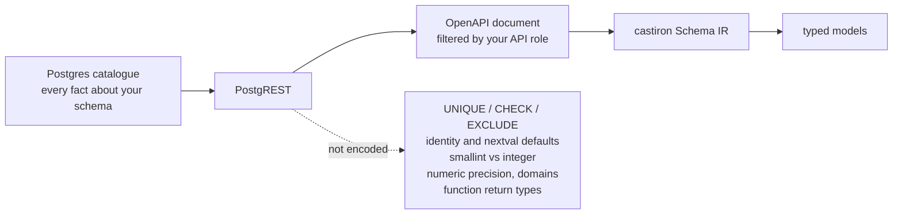

# The OpenAPI source: what it can and cannot see

> The OpenAPI source needs no database credentials and sees everything your API key can
> see — column types, nullability, primary keys, single-column foreign keys, enums, and
> RPC argument names and types. It cannot see unique or check constraints, identity/generated
> columns, exact integer widths below `bigint`, function return types, or the order a
> function's arguments were declared in. Point castiron at the database itself when you need
> those.

That is the whole page in one paragraph. The rest explains *why* each limit exists, what it
does to your generated code, and what to do about it — because a code generator that
overstates what it knows is worse than one that tells you where it stops.

## The trade



castiron reads one document: the **OpenAPI (Swagger 2.0) description PostgREST publishes
at its API root**. One authenticated `GET`, no driver, no connection string, no firewall
rule. Every fact castiron knows about your schema is a fact PostgREST chose to encode
there — and PostgREST built that document to describe an HTTP API, not to reproduce a
Postgres catalogue.

So the source's ceiling is PostgREST's ceiling. That is not a defect castiron can patch:
the information is not in the file. What castiron *can* do — and does — is refuse to
guess. Anything the document does not state stays unknown rather than becoming a
plausible-looking lie in your models.

Two further consequences of reading an API description rather than a catalogue:

- **You see what your API role sees — object by object, not column by column.** Tables and
  functions your key cannot access are not "hidden": they are absent, indistinguishable from
  not existing. This is why the run summary prints the counts it read; `read 2 tables`
  when you expected 20 is your signal. **Column-level privileges are a different matter —
  PostgREST does not apply them to the document at all**, so castiron emits fields for
  columns your key cannot read. See
  [Privileges filter objects, not columns](#privileges-filter-objects-not-columns).
- **One schema per document.** PostgREST serves one schema at a time, selected by
  `Accept-Profile` (castiron's `--schema`). Cross-schema foreign keys are not resolvable
  from a single run.

## The full picture

Legend: **✅ full** — the fact is exact. **⚠ partial** — something survives, degraded.
**❌ absent** — not in the document at all. **n/a** — the comparison does not apply.

### Tables, views and columns

| Fact | OpenAPI source | Live DB source (planned) | Why |
| --- | --- | --- | --- |
| Table/view names, columns | ✅ full | ✅ | `definitions` |
| Column nullability | ✅ full for tables; ⚠ **every view column is reported nullable** | ✅ | `required` lists exactly the NOT NULL columns; PostgREST reports view columns nullable |
| Table vs view | ⚠ **inferred from one signal** — no view marker is emitted, so a non-empty `required` list means `BASE TABLE` and anything else means `VIEW`; see [below](#table-or-view-is-inferred-from-one-signal) | ✅ `relkind` | the document carries no marker |
| Column type | ⚠ **`smallint` and `integer` both arrive as `int32`**; `bigint` survives as `int64`; every other type keeps its Postgres name | ✅ exact | PostgREST's `toSwaggerFormat` |
| Numeric precision/scale, `varchar(n)` typmod | ❌ lost (`maxLength` survives, but see [below](#string-lengths-survive-but-do-not-become-constraints)) | ✅ | `format_type(atttypid, NULL)` erases them |
| Domain types | ❌ collapse to their base type | ✅ | resolved before the document is built |
| Column default | ⚠ **only when it survives a JSON decode** — string-ish defaults (`now()`, `gen_random_uuid()`, `'text'`) come through; **`nextval(...)` is silently dropped** | ✅ | PostgREST re-quotes string-ish defaults as JSON; for other types the raw default text must itself be valid JSON |
| Identity / generated columns | ❌ **always false** — see [below](#identity-and-generated-columns) | ✅ | no `nextval` reaches the document |
| Column comments | ✅ full | ✅ | `description` |
| Table comments | ✅ full | ✅ | `definitions.<t>.description` → the model docstring |
| Objects (tables, views, functions) the API role cannot see | ❌ **invisible** — RLS and privileges silently shrink the schema | ✅ | PostgREST's default openapi-mode |
| Columns the API role cannot `SELECT` | ⚠ **still described, and still emitted** — column privileges are not applied to the document; see [below](#privileges-filter-objects-not-columns) | n/a | PostgREST filters relations, not columns — a generated model is not a privilege boundary |

### Keys and constraints

| Fact | OpenAPI source | Live DB source (planned) | Why |
| --- | --- | --- | --- |
| Primary-key membership | ✅ full | ✅ | `<pk/>` marker in a column's description |
| Composite primary-key **order** | ❌ not recoverable | ✅ | markers are per column, unordered |
| A view's primary key | ⚠ recorded as **UNIQUE, not PRIMARY KEY** — see [below](#views) | ✅ | a downgrade, not a guess |
| Foreign keys | ⚠ **single-column only**; no schema; the constraint name is synthesized as `<table>_<column>_fkey` | ✅ | `<fk table='..' column='..'/>` marker |
| Composite foreign keys | ❌ invisible; a column in two foreign keys reports only one | ✅ | one marker per column |
| **UNIQUE constraints** | ❌ **absent entirely** | ✅ | not in the document |
| **CHECK constraints** | ❌ **absent entirely** | ✅ | not in the document |
| **EXCLUDE constraints** | ❌ absent | ✅ | not in the document |
| Cross-schema / multi-schema | ❌ one schema per document | ✅ | PostgREST design |

### Enums

| Fact | OpenAPI source | Live DB source (planned) | Why |
| --- | --- | --- | --- |
| Enum values on a scalar column | ✅ full, **with the type name** (schema-qualified when needed) | ✅ | `enum` + `format` |
| Enum values on an **array** column | ⚠ **absent** — such a column links to an enum only if the same enum also appears on a scalar column somewhere in the document; otherwise it degrades to `list[Any]` | ✅ | PostgREST looks up `pg_enum` by base type, which misses array types |

### Functions (RPCs)

| Fact | OpenAPI source | Live DB source (planned) | Why |
| --- | --- | --- | --- |
| Name, schema | ✅ full | ✅ | the `/rpc/<name>` path key |
| Argument names, has-default | ✅ full | ✅ | the POST body schema's `properties` and `required` |
| Argument **order** | ⚠ **alphabetical — not the order the function was declared with**; recoverable for a `STABLE`/`IMMUTABLE` function only, and castiron does not read it yet. See [below](#argument-order-is-alphabetical) | ✅ | the POST body's `properties` arrive sorted by name |
| Argument types | ⚠ **as degraded as a column type, plus one loss beyond it** — `smallint` and `integer` both arrive as `int32`, and `char(2)` arrives as `character` with **no `maxLength`**, which the same column would carry | ✅ exact | `toSwaggerFormat` again; `maxLength` is emitted for columns only |
| An argument's **enum values** | ❌ **never carried on the argument** — it links to an enum only if the same enum also appears on a scalar column somewhere in the document; otherwise the argument keeps a bare type name and no values | ✅ | the parameter declares `format` but no `enum` list, and its type name is unqualified |
| **Return type** | ❌ **never available** | ✅ | responses carry only `"OK"` |
| **Set-returning** | ❌ **never available** | ✅ `proretset` | not encoded |
| Volatility | ⚠ **binary only** — `VOLATILE` (POST-only) vs non-volatile (a GET exists); `STABLE` vs `IMMUTABLE` unknown | ✅ | inferred from method gating |
| **Overloads** | ❌ **collapsed upstream** — one arbitrary signature survives | ✅ | one path key per function name |
| `OUT` / `INOUT` / `TABLE` params | ⚠ `INOUT` appears as an input; `OUT` params are excluded | ✅ | not encoded as inputs |

!!! note "Functions are read but not yet emitted"
    `castiron gen` reports the function count it read (`read 6 tables, 1 enum and 4
    functions`) and lowers them into the Schema IR, but no shipped emitter consumes them
    yet. The typed RPC client is a later milestone — and, because return types are never
    available from this source, a genuinely typed RPC client depends on the live-DB source.

## Identity and generated columns

This is the limit you meet within thirty seconds of your first run — so it gets a
warning, a flag, and this section.

PostgREST passes each column's default text through a JSON decoder and keeps it only if it
parses. `nextval('orders_id_seq'::regclass)` is not JSON, so it is dropped — and there is
no separate identity flag in the document. A textbook Supabase primary key:

```sql
create table orders (
  id bigint generated by default as identity primary key,
  ...
);
```

therefore arrives at castiron as *"NOT NULL, no default, not identity"* — which is
exactly how a natural key like `year int primary key` arrives. The two are
indistinguishable in the document.

castiron will not guess, so by default it believes what it was told and marks the column
**required on the Insert model**:

```python
class OrdersInsert(CustomModelInsert):
    """Orders Insert Schema.

    Customer orders.
    """

    # Primary Keys
    id: int

    # Required fields
    total: Decimal
    user_id: int = Field(description="The customer who placed the order.")
```

That is annoying but *safe*: your code is forced to be explicit, and a wrong guess never
reaches your database. The alternative — silently assuming every integer primary key is
generated — makes `year int primary key` optional on insert and turns a compile-time
annoyance into a runtime constraint violation in production.

### The warning

Because the fix is one flag away, castiron says so — once per run, on stderr, and **only
when the inference would actually change the output**:

```
castiron: 4 tables have an integer primary key with no visible default (orders, products, restricted_table and 1 more) -- PostgREST does not expose nextval()/identity defaults, so castiron marks those columns required on the Insert models. Pass --infer-generated-primary-keys (or set infer-generated-primary-keys = true) if they are serial/identity columns.
```

If your keys are UUIDs, or composite, or genuinely natural, the warning never fires.

### `--infer-generated-primary-keys`

If you know your integer primary keys are serial/identity columns — for a Supabase project
they almost always are — turn the inference on:

```bash
castiron gen --from ./openapi.json --infer-generated-primary-keys
```

```python
class OrdersInsert(CustomModelInsert):
    """Orders Insert Schema.

    Customer orders.
    """

    # Required fields
    total: Decimal
    user_id: int = Field(description="The customer who placed the order.")
```

`id` is gone from the Insert model, which is what you wanted.

The rule is narrow on purpose: it applies only to a **sole** primary-key column that is
NOT NULL, has no visible default, is not already flagged as identity, and whose type is
`smallint`, `integer` or `bigint`. It is still an inference — it is named as one, and it is
off by default, so nothing infers anything on your behalf unless you ask. Set it in your
config file once you have decided:

```toml
[tool.castiron]
infer-generated-primary-keys = true
```

## Other consequences worth knowing

### String lengths survive but do not become constraints

`character varying(255)` arrives with its `maxLength`, and the IR keeps it. But castiron's
Pydantic emitter derives `Annotated[str, StringConstraints(...)]` from **`length()` CHECK
constraints**, which this source never provides. So a `varchar(255)` column generates a
plain `str`:

```python
email: str
```

Nothing is wrong and nothing is invented — the length is simply not expressed as a
constraint in the generated model today.

### Views

Every column of a view is reported nullable by PostgREST, so every field on a view model
is optional:

```python
class ActiveUsersViewBaseSchema(CustomModel):
    """ActiveUsersView Base Schema.

    Users with a recent login.
    """

    # Columns
    email: str | None = Field(default=None)
    favorite_product_id: int | None = Field(default=None)
    id: int | None = Field(default=None)
```

PostgREST *does* propagate key markers through views, but castiron's IR defines a view as
having no primary key — so the marker is retained one step down, as a **UNIQUE**
constraint. That is a deliberate downgrade rather than a discard: it keeps the fact the
document actually stated, and it is what tells a foreign key pointing *at* the view that
the relationship is many-to-one rather than many-to-many.

### Table or view is inferred from one signal

The document carries **no view marker at all** — PostgREST computes `relkind IN ('v','m')`
internally and never writes it down — so castiron infers the relation kind, and it infers it
from exactly one thing: the definition's `required` array.

```
required is non-empty  →  BASE TABLE
anything else          →  VIEW
```

That is the whole rule. It rests on a Postgres catalogue fact rather than on a PostgREST
behaviour: `required` is exactly the NOT NULL set, and a view column's
`pg_attribute.attnotnull` is always false, so **a view never carries `required`**.

**Both directions of the inference can be wrong, and it is worth knowing how:**

- A **base table whose every column is nullable** is classified as a `VIEW`. Nothing in the
  document distinguishes it from one.
- A **view with at least one column reported NOT NULL** would be classified as a
  `BASE TABLE`. Postgres does not produce that shape today, which is why the rule is worth
  making, but the inference is what it is — the document is not being read for a fact it
  states, it is being read for a fact that correlates.

Misreading a table as a view has a bounded cost: a view has no primary key in castiron's IR,
so a `<pk/>` marker on it is retained one step down as a UNIQUE constraint (above). A base
table that lands in the ambiguous cell has no NOT NULL column at all, and a Postgres PRIMARY
KEY column is NOT NULL — so it has no primary key to lose.

**Write verbs are not a signal.** An earlier release also read `post`/`patch`/`delete` on the
relation's path as evidence of table-ness. Measured against PostgREST v12.2.3 and v14.14, the
verbs track Postgres *auto-updatability*, not relation kind: a `GRANT SELECT`-only simple view
is auto-updatable and gets all three. On the captured 26-relation schema the verb signal was
present on 24 relations including 3 of the 5 views. It was noise, and it is gone.

### Privileges filter objects, not columns

This one runs in the unsafe direction, so read it even if you skip the rest.

PostgREST's default `openapi-mode` hides *relations* the API role cannot reach: a table your
key cannot read is absent from `definitions`, and a function it cannot execute has no
`/rpc/` path. **That filtering stops at the relation boundary.** A column carrying a
column-level `REVOKE` is still described in its table's `properties` — measured against
PostgREST v12.2.3 and v14.14, and still present when `openapi-mode = ignore-privileges` is
set, so its presence is not an artifact of the privilege filter. It is simply not filtered.

```sql
REVOKE ALL ON public.partially_visible FROM anon;
GRANT SELECT (id, title) ON public.partially_visible TO anon;
```

`secret_body` is not readable by `anon`. It arrives in the document anyway, so castiron emits
a field for it:

```python
class PartiallyVisibleBaseSchema(CustomModel):
    """PartiallyVisible Base Schema."""

    # Primary Keys
    id: int

    # Columns
    secret_body: str
    title: str
```

**A generated model is not a privilege boundary.** It describes the schema PostgREST
published, not the subset of it your key may read — so a model can name a column that fails
with a permission error the moment you select it. Treat the models as a description of the
schema's *shape*; get "what may this role read?" from `information_schema.column_privileges`,
never from generated code.

### Argument order is alphabetical

This one also runs in the unsafe direction, because nothing about the result *looks* wrong.

A function's POST body schema lists its arguments **sorted by name**, not in the order the
function was declared. `search_products(p_terms text[], p_limit integer default 20)` arrives
as:

```json
"properties": {
  "p_limit": { "format": "int32", "type": "integer" },
  "p_terms": { "format": "text[]", "type": "array", "items": { "type": "string" } }
}
```

castiron builds its parameter list from that body, so the two land in the IR as
`p_limit, p_terms` — reversed. Their names, types and defaults are each correct; only the
order is not.

Declaration order does survive, in exactly one place: the **GET** operation's `parameters`
array, which for the same function lists `p_terms` before `p_limit`. PostgREST emits a GET
operation only for a `STABLE`/`IMMUTABLE` function, so declaration order is recoverable for
those and **structurally absent for a `VOLATILE` one**. castiron does not read it yet.

Nothing shipped is wrong today — no emitter consumes function parameters (see the note
above). It matters the moment one does: a client that called an RPC **positionally** from
this order would swap arguments silently. Call PostgREST functions by argument name, which is
what the JSON body is anyway, and the order never matters.

### Integer widths

`smallint` and `integer` are the same token (`int32`) in the document. For the Pydantic
emitter this is currently invisible — both resolve to `int` — but it is real, and it will
matter to an emitter that cares about storage, such as a future SQLAlchemy emitter
choosing between `SmallInteger` and `Integer`. `bigint` is distinguishable (`int64`).

### Unknown types never fail

A type token castiron does not recognise is recorded verbatim and resolved to `Any` rather
than aborting the run. You get models, and the unrecognised column is honestly untyped.

## When to upgrade

Use the OpenAPI source when you want reach: no credentials, no driver, CI-friendly, and a
document you can save and replay offline. That covers most day-to-day model generation.

Reach for a live-database source when any of these are load-bearing for you:

- UNIQUE, CHECK or EXCLUDE constraints (and the validation you would derive from them)
- identity/generated columns as fact rather than inference
- exact integer widths, numeric precision/scale, `varchar(n)`, domain types
- composite foreign keys, composite primary-key order, cross-schema relationships
- function return types, set-returning functions, overloads, or the declared order of a
  function's arguments
- anything your API role cannot see

The live-database source is on the roadmap and is not shipped yet. Until it lands, this
page is the complete list of what a generated model can and cannot be trusted to know.
Every claim above about *castiron's* behaviour is asserted by a test under `tests/unit/`
(`sources/openapi/` for the parser, `corpus/` for the emitted bytes), so the floor cannot
move quietly; the claims about *PostgREST's* behaviour were measured against a live
Postgres + PostgREST apparatus on two versions, because no test castiron owns can pin
somebody else's server.
